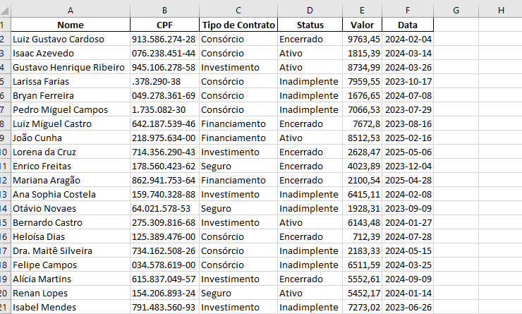
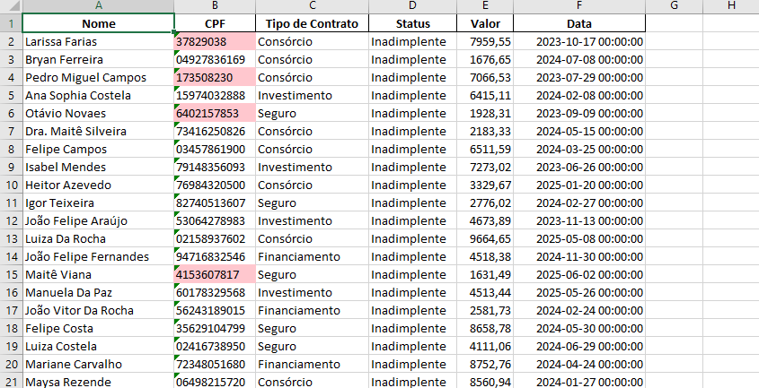

# tela de upload

# tela de download

# arquivos brutos

# arquivos analizados

# Projeto: Análise de Excel com Servidor Local Flask

Este projeto é uma aplicação web construída com **Flask** que permite o upload, validação, organização e download de arquivos Excel, CSV e JSON. A ideia é facilitar a análise e processamento de dados diretamente em um servidor local, garantindo uma interface simples para o usuário.

---

## Funcionalidades principais

- Upload múltiplo de arquivos `.xlsx`, `.csv` e `.json`.
- Validação das colunas obrigatórias nos arquivos enviados.
- Armazenamento dos arquivos enviados em pastas específicas no servidor.
- Download dos arquivos processados ou organizados.
- Página web com interface simples para facilitar o uso.
- Flag para indicar se o servidor está ativo (`server_on.flag`).
- Mensagens de feedback para o usuário (sucesso, erro, aviso).

---

## Tecnologias usadas

- Python 3.x
- Flask
- Pandas (para manipulação e validação dos arquivos)
- HTML + Bootstrap (para interface web)

---

## Como rodar o projeto

### Pré-requisitos

Antes de executar, é necessário instalar as dependências. Use o comando abaixo:  
`pip install flask pandas openpyxl`

1 - execute o arquivo .bat:  
`rodar_servidor`

2 - use os arquivos para upload que estão na pasta:  
`arquivos_teste`

3 - veja o funcionamento do programa.

o programa executa o codigo de leitura de arquivos a cada 3 segundos pois foi pensado em um modelo em que gere um grande fluxo de dados, o consumo desse sistema é cerca de 20 a 50 mb de ram.
